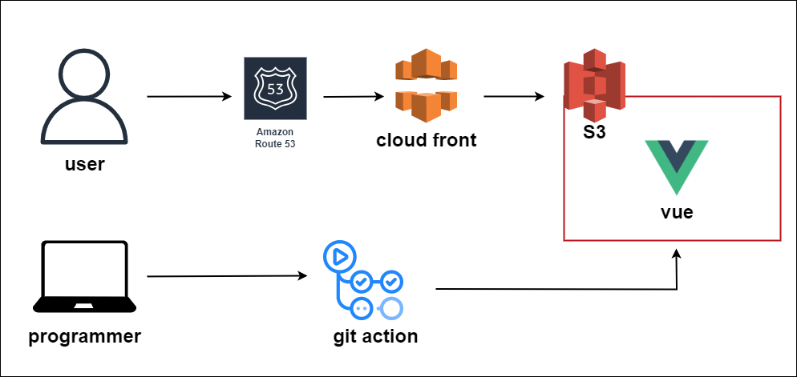
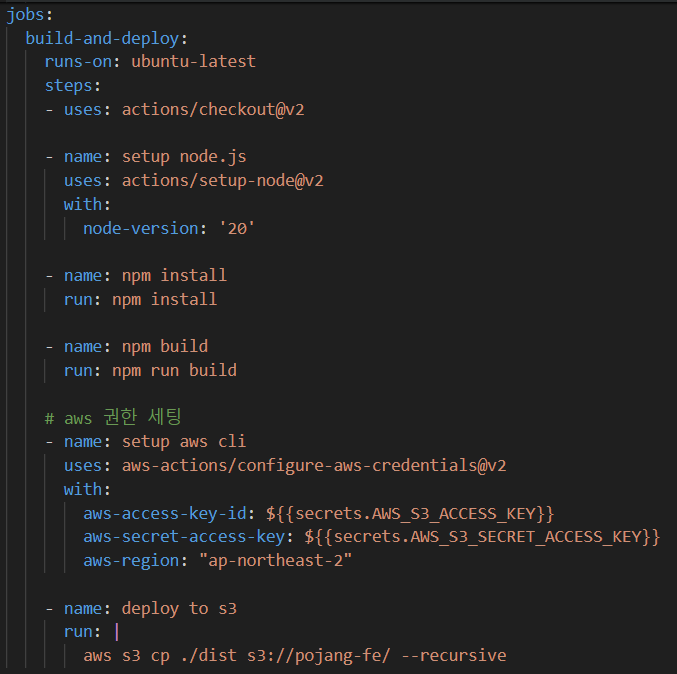

# 🎁 포장의 민족

  

 

 

# 📈아키텍처 설계서

## 📍프론트엔드 아키텍처

 

# 📝구성스크립트

## Frontend

 

# 📈아키텍처 상세문서

## 프론트엔드

### 1. 개요
이 아키텍처는 프론트엔드 정적 웹 애플리케이션의 CI/CD 파이프라인 구축과 높은 가용성, 보안을 위한 구성을 목표로 합니다. 
GitHub 저장소에 코드 변경이 발생할 때마다 자동으로 빌드 및 배포 프로세스가 실행되어 Amazon S3에 정적 웹사이트를 호스팅합니다.
Amazon CloudFront를 통해 전 세계에 콘텐츠를 빠르게 제공하며, AWS Certificate Manager(ACM)에서 발급받은 SSL 인증서를 적용하여 HTTPS를 통한 안전한 접근을 보장합니다.
Amazon Route 53은 도메인 이름 시스템(DNS) 서비스를 제공하여 사용자가 웹 애플리케이션에 쉽게 접근할 수 있도록 합니다.
    
### 2. 주요 컴포넌트
- **GitHub Actions**: GitHub 저장소에 코드 변경이 감지되면 자동으로 빌드 및 배포 프로세스를 실행
- **Amazon S3 버킷**: 빌드된 정적 파일을 호스팅
- **AWS Certificate Manager**: SSL 인증서를 관리합니다. 인증서는 CloudFront 배포에 연결하여 HTTPS 통신을 가능하게 함
- **Amazon CloudFront**: S3 버킷에 호스팅된 정적 웹사이트 앞에 위치하는 CDN 서비스로, 캐싱을 통해 전 세계적으로 빠른 콘텐츠 제공을 가능하게 하며, ACM에서 발급받은 SSL 인증서를 사용하여 안전한 HTTPS 연결을 제공
- **Amazon Route 53**: 웹 애플리케이션의 도메인 이름을 관리하고, CloudFront 배포와 매핑하여 사용자가 웹 애플리케이션에 쉽게 접근할 수 있도록 함
